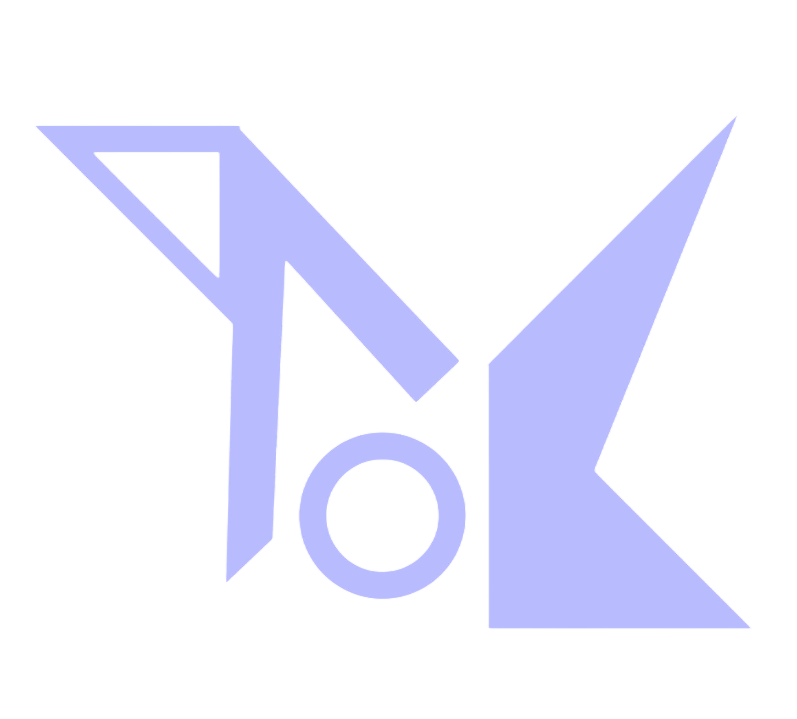

    An independent systemd-free Linux Distribuition.

  
  
  

  

  

    <a href="https://the-koreos-project.github.io/Manual">Manual</a> • <a href="https://the-koreos-project.github.io/Install">Install</a> • <a href="https://discord.gg/JJ9jdAQJpT">Discord</a>

------

